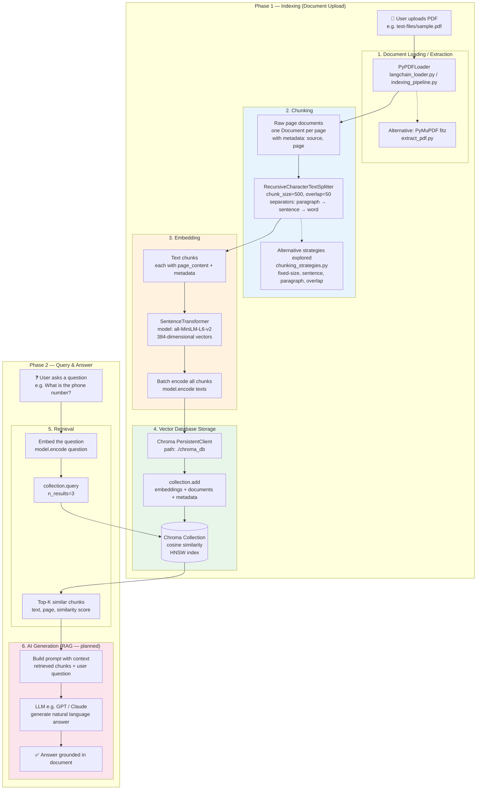

# RAG Flow: Document Upload to Answering

This document describes the end-to-end flow implemented in this repo — from uploading a PDF to answering a question using Retrieval-Augmented Generation (RAG).

---

## High-Level Overview

RAG has two main phases:

| Phase | Purpose | Entry point |
|-------|---------|-------------|
| **Indexing** | Ingest a document so it can be searched later | `index_document()` in `indexing_pipeline.py` |
| **Query & Answer** | Find relevant chunks and produce an answer | `query_document()` in `indexing_pipeline.py` + LLM (planned) |

---

## Full Flow Diagram



---

## ASCII Flow (Simplified)

```
UPLOAD PATH                          QUERY PATH
───────────                          ──────────

  PDF file                             User question
      │                                      │
      ▼                                      ▼
 ┌─────────┐                          ┌─────────────┐
 │  LOAD   │  PyPDFLoader             │  EMBED Q    │  SentenceTransformer
 └────┬────┘                          └──────┬──────┘
      │                                      │
      ▼                                      ▼
 ┌─────────┐                          ┌─────────────┐
 │  CHUNK  │  RecursiveCharacter      │  VECTOR DB  │  Chroma cosine search
 │  500/50 │  TextSplitter              │  top-3      │
 └────┬────┘                          └──────┬──────┘
      │                                      │
      ▼                                      ▼
 ┌─────────┐                          ┌─────────────┐
 │ EMBED   │  all-MiniLM-L6-v2        │  RETRIEVE   │  relevant chunks + scores
 │ 384-dim │  batch encode            └──────┬──────┘
 └────┬────┘                                 │
      │                                      ▼
      ▼                               ┌─────────────┐
 ┌─────────┐                          │  LLM (AI)   │  context + question → answer
 │ CHROMA  │  store vectors           └─────────────┘
 └─────────┘
```

---

## Step-by-Step Breakdown

### Step 1 — Document Loading (Extraction)

**What happens:** The PDF is opened and text is extracted page by page.

| Approach | File | Library |
|----------|------|---------|
| Production pipeline | `indexing_pipeline.py` | `PyPDFLoader` (LangChain) |
| LangChain experiment | `langchain_loader.py` | `PyPDFLoader` |
| Manual extraction | `extract_pdf.py` | PyMuPDF (`fitz`) |

**Output:** A list of LangChain `Document` objects — one per page — each containing:
- `page_content` — the extracted text
- `metadata` — e.g. `source` (file path), `page` (page number)

```python
loader = PyPDFLoader(file_path)
docs = loader.load()
```

---

### Step 2 — Chunking

**What happens:** Long page text is split into smaller, overlapping pieces so embeddings capture focused meaning and retrieval returns precise passages.

| Approach | File | Strategy |
|----------|------|----------|
| Production pipeline | `indexing_pipeline.py` | `RecursiveCharacterTextSplitter` |
| LangChain experiment | `langchain_loader.py` | Same splitter |
| Strategy comparison | `chunking_strategies.py` | Fixed-size, sentence, paragraph, overlap |

**Production settings:**
- `chunk_size=500` characters
- `chunk_overlap=50` characters (context preserved across chunk boundaries)
- Separators tried in order: `\n\n` → `\n` → `. ` → ` ` → character-level

```python
splitter = RecursiveCharacterTextSplitter(
    chunk_size=500,
    chunk_overlap=50,
    separators=["\n\n", "\n", ". ", " ", ""]
)
chunks = splitter.split_documents(docs)
```

**Why chunking matters:** Embedding models have token limits; smaller chunks improve retrieval precision. Overlap prevents sentences from being cut in half at boundaries.

---

### Step 3 — Embedding

**What happens:** Each text chunk is converted into a fixed-size numerical vector that captures semantic meaning.

| Detail | Value |
|--------|-------|
| Model | `all-MiniLM-L6-v2` (Sentence Transformers) |
| Dimensions | 384 |
| File | `indexing_pipeline.py`, `01-embeddings/embed.py` |

**How it works:**
- Similar meaning → vectors close together in 384-dimensional space
- Chunks are encoded in **batch** for speed: `model.encode(texts).tolist()`

```python
model = SentenceTransformer("all-MiniLM-L6-v2")
texts = [chunk.page_content for chunk in chunks]
embeddings = model.encode(texts).tolist()
```

---

### Step 4 — Vector Database (Chroma)

**What happens:** Embeddings, original text, and metadata are stored in a persistent local vector database for fast similarity search.

| Detail | Value |
|--------|-------|
| Database | Chroma (`PersistentClient`) |
| Storage path | `./chroma_db` |
| Similarity metric | Cosine (`hnsw:space: cosine`) |
| Collection name | `"documents"` (default) |

**Stored per chunk:**
| Field | Example |
|-------|---------|
| `embeddings` | 384-dim vector |
| `documents` | chunk text |
| `metadatas` | `source`, `page`, `chunk_index` |
| `ids` | `{file_path}_chunk_{i}` |

```python
collection.add(
    embeddings=embeddings,
    documents=texts,
    metadatas=[{"source": ..., "page": ..., "chunk_index": i}, ...],
    ids=[f"{file_path}_chunk_{i}" for i in range(len(chunks))]
)
```

---

### Step 5 — Retrieval (Query)

**What happens:** When a user asks a question, the question is embedded with the **same model**, then Chroma finds the most similar stored chunks.

**Function:** `query_document()` in `indexing_pipeline.py`

```python
query_embedding = model.encode([question]).tolist()
results = collection.query(
    query_embeddings=query_embedding,
    n_results=3  # top 3 most similar chunks
)
```

**Returns per match:**
- `text` — chunk content
- `page` — source page number
- `score` — similarity score (`1 - cosine distance`, higher = more relevant)

---

### Step 6 — AI Generation (Planned RAG Completion)

**What happens:** Retrieved chunks are passed to a Large Language Model (LLM) as context. The LLM generates a natural-language answer grounded in the document.

> **Note:** This step is described in the project README (`03-rag-pipeline — retrieve + generate`) and referenced in `indexing_pipeline.py` comments as the next integration point (e.g. FastAPI chatbot). The retrieval half is implemented; generation is the final RAG piece.

**Typical prompt structure:**

```
You are a helpful assistant. Answer the question using ONLY the context below.

Context:
{chunk_1}
{chunk_2}
{chunk_3}

Question: {user_question}

Answer:
```

**Why the LLM is needed:** Retrieval alone returns raw text fragments. The LLM synthesizes those fragments into a coherent, conversational answer and can refuse to answer when context is insufficient.

---

## Component Map

| Component | Technology | Where Used |
|-----------|------------|------------|
| PDF extraction | PyPDFLoader / PyMuPDF | `indexing_pipeline.py`, `extract_pdf.py` |
| Chunking | RecursiveCharacterTextSplitter | `indexing_pipeline.py`, `langchain_loader.py` |
| Embedding model | SentenceTransformer `all-MiniLM-L6-v2` | `indexing_pipeline.py`, `01-embeddings/` |
| Vector DB | Chroma (persistent, cosine) | `indexing_pipeline.py`, `01-embeddings/chroma_experiment.py` |
| Retrieval | `collection.query()` | `indexing_pipeline.py` → `query_document()` |
| AI / LLM | Not yet implemented | Planned in `03-rag-pipeline` |

---

## Data Flow Summary

```
PDF
 └─► pages (Documents)
      └─► chunks (500-char segments)
           └─► embeddings (384-dim vectors)
                └─► Chroma collection

Question
 └─► question embedding (384-dim vector)
      └─► Chroma similarity search
           └─► top-3 chunks + scores
                └─► LLM prompt (context + question)
                     └─► natural language answer
```

---

## Key Files

| File | Role |
|------|------|
| `indexing_pipeline.py` | **Main pipeline** — `index_document()` + `query_document()` |
| `langchain_loader.py` | Load + chunk experiment with LangChain |
| `extract_pdf.py` | Manual PDF text extraction with PyMuPDF |
| `chunking_strategies.py` | Compares different chunking approaches |
| `01-embeddings/embed.py` | Embedding model basics |
| `01-embeddings/chroma_experiment.py` | Chroma storage and query basics |
| `01-embeddings/similarity.py` | Cosine similarity concepts |

---

## Running the Pipeline

```bash
# From 02-document-processing/
python indexing_pipeline.py
```

This will:
1. Index `test-files/sample.pdf` into Chroma
2. Query: *"What is the phone number of the candidate?"*
3. Print the top 3 matching chunks with similarity scores
